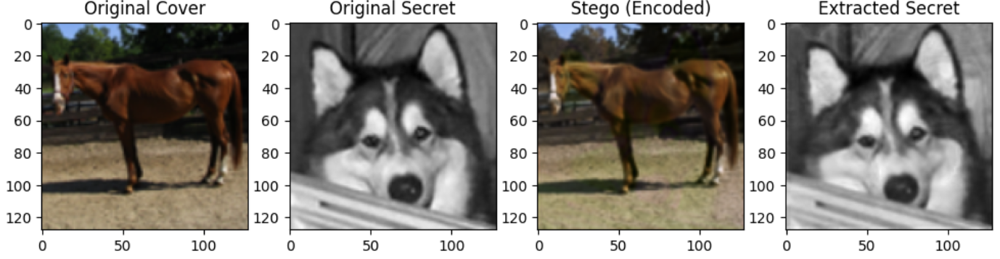

## DeepVeil: Deep Learning Steganography

This repo implements a blind steganography system using a Convolutional Neural Network (CNN).
It allows us to hide a grayscale SECRET inside a full-color COVER image, producing a STEGO IMAGE, that looks almost identical to the COVER.

---

### What is Steganography

Steganography hides the very existence of the message in a image. In digital imaging, this involves modifying the pixel values of a cover image to embed secret data without creating visible artifacts.

---

### Architecture
The system uses an Encoder-Decoder framework:

**Encoder**: Takes a 3-channel RGB Cover image and a 1-channel Grayscale Secret image (Total 4 channels).

**Decoder**: Takes only the 3-channel Stego image and learns to reconstruct the 1-channel Secret image.

---
### Logic and Math

**Invisibility**: The Stego image must look like the Cover.

**Recovery**: The Extracted Secret must look like the original Secret.

We use weighted MSE loss to balance equality:

$Total Loss = (β⋅MSE(Stego,Cover)) + ((1−β)⋅MSE(Extracted,Secret))$

A higher β (e.g., 0.85) ensures the Stego image remains visually perfect.
